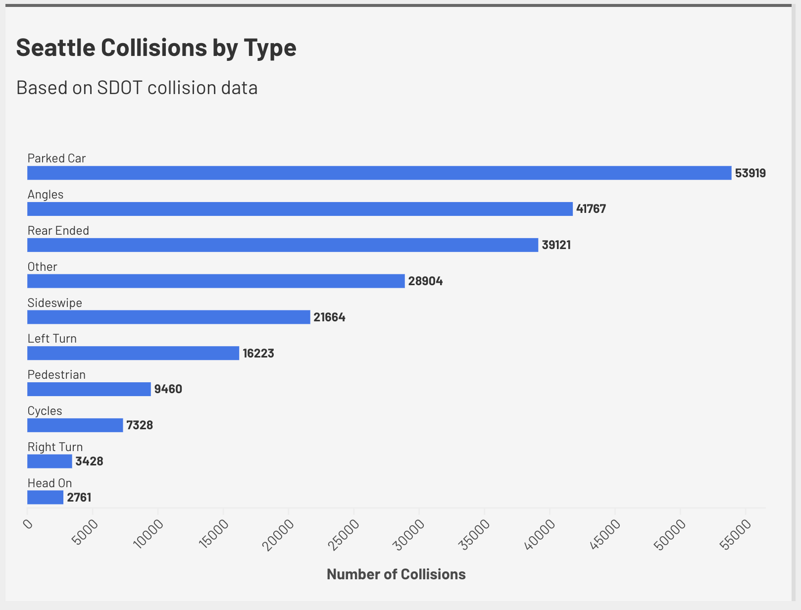

## Seattle Collisions by Type

This visualization shows the number of traffic collisions in Seattle grouped by their collision type. 
The data i got was from data.seattle.gov website (Seattle Open Data portal (SDOT Collisions All Years)) as a csv file and was cleaned and aggregated to count how frequently each type of collision happens.

I processed the data in Excel to group collisions by type before being visualized in Flourish.

This chart highlights that certain collision types, such as parked car and angle collisions, occur more frequently than others.

### Data Source

Seattle Open Data – SDOT Collisions All Years

### Visualization

### Flourish Link

https://public.flourish.studio/visualisation/28549111/

